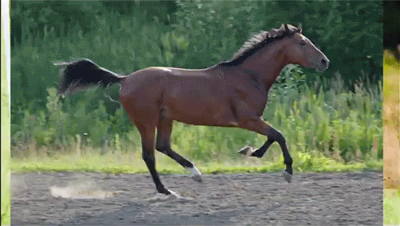

## Hi there, I'm Cedric 😃.
I'm a Mauritian :mauritius: Mechatronics Engineering student :robot: currently studying in Germany.
I like coding and learning new stuff.

  

  More about me

## My Skills 📜
- #### Python
  - Machine Learning
  - Computer Vision
  - Robot Programming (ROS)
- #### C++
- #### MATLAB
  - Rapid Prototyping and Real-Time Simulation
  - State Space Modelling
    
---

## What I'm Currently Working On 📖
- #### [Machine Learning and ROS](https://github.com/cedricfyc/Online_tutorials)
- #### Microcontroller Programming (to be added to GitHub)
- #### Improving my German to a C1

---

## My Hobbies ☺️
- #### Fitness Training
- #### Reading Mangas
- #### Coding
- #### Bouldering
- #### Watching Youtube Essay Videos

---

## Languages I speak 🌐

| Language                | Proficiency                                            |
| ------------------------| ------------------------------------------------------ |
| English                 | C1                                                     |
| French                  | C1                                                     |
| German                  | B2                                                     |
| Spanish                 | A2                                                     |
| Mauritian Creole        | Native                                                 |

---

## My Socials 🧑‍🤝‍🧑

---

  

  <h4>Inspirations for my README</h4> 

  
- [Format from filiptronicek](https://github.com/filiptronicek)
- [Icons from peterthehan](https://github.com/peterthehan)

<!--
**cedricfyc/cedricfyc** is a ✨ _special_ ✨ repository because its `README.md` (this file) appears on your GitHub profile.

Here are some ideas to get you started:

- 🔭 I’m currently working on ...
- 🌱 I’m currently learning ...
- 👯 I’m looking to collaborate on ...
- 🤔 I’m looking for help with ...
- 💬 Ask me about ...
- 📫 How to reach me: ...
- 😄 Pronouns: ...
- ⚡ Fun fact: ...
-->
